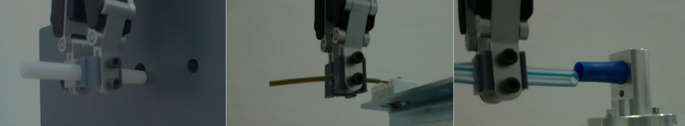
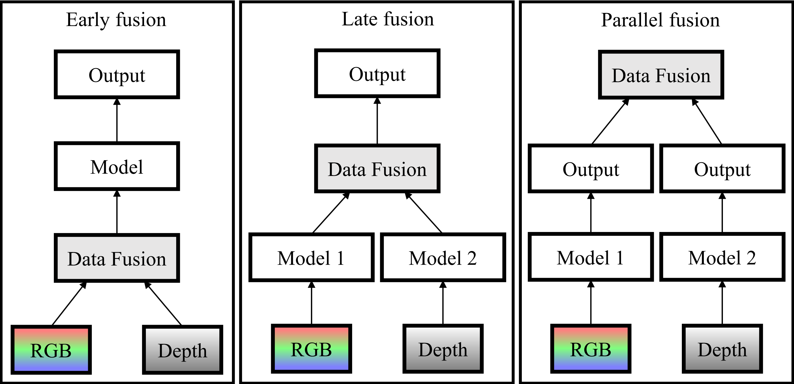

# Learning-Based 3D Vision Sensor for Robotic Insertion

This repository contains the implementation of a Learning-Based 3D Vision Sensor designed for robotic Peg-In-Hole (PIH) insertion tasks involving both rigid and deformable objects.



The system utilizes a Late Fusion CNN architecture (ResNet-18 based) to process RGB and Depth data, estimating the relative position (radius and angle) of the peg with respect to the hole. The core innovation lies in treating the regression problem as a classification task with probability interpolation, achieving high robustness in industrial environments.



## Project Structure

The project is organized to separate data processing, model training, and evaluation:

```text
LDO-ROBOTIC-INSERTION/
├── src/                    # Core source code
│   ├── model.py            # CNN Architectures (Late Fusion, RGB, Depth)
│   ├── train.py            # Training loop logic
│   ├── sensor.py           # Virtual Sensor logic
│   ├── dataset.py          # PyTorch Dataset & Dataloader
│   ├── visualization/      # Plotting & Activation Maps
│   └── data_processing/    # Scripts for cleaning & splitting data
├── experiments_archive/    # Legacy notebooks and raw experiment logs
├── notebooks/              # Clean demo notebooks
└── results/                # Model weights and output graphs
```
## Getting Started

### 1. Prerequisites
It is recommended to use a Conda environment to manage dependencies and CUDA versions.

Create the environment from the `environment.yml` file:
```bash
conda env create -f environment.yml
```

### 2. Data Preparation
The pipeline expects raw data organized in folders (set1, set2...) containing RGB and Depth images.
Run the full preprocessing pipeline (Organization -> Centering -> Augmentation -> Split -> Labeling):

python src/data_processing/preprocess.py

Output: dataset/final_split/ containing train and test folders with CSV labels.

### 3. Training
To train a model (e.g., Late Fusion for Angle estimation):

python run_training.py

Check the CONFIG dictionary inside run_training.py to switch between Lrgbd, rgb, depth and targets angle/rad.

### 4. Evaluation & Inference
To generate predictions on the test set using the trained weights:

python generate_results.py

This supports both Standard (Late Fusion) and Parallel (Ensemble) modes.

### 5. Visualization
Generate performance graphs (RMSE, Confusion Matrix, Spatial Error) and Activation Maps:

python generate_graphs.py
python generate_activation_maps.py

## Key Features

* Late Fusion Architecture: Merges RGB and Depth features at the fully connected layer.
* Classification-to-Regression: Discretizes the continuous space into classes and recovers the precise value using a weighted mean of the probability vector.
* Circular Mean Calculation: Handles angle periodicity (0 deg approx 360 deg) correctly during interpolation.
* Robustness: Includes mechanisms for "In/Out" classification to guide the robotic control loop.

## Citation

If you use this code for your research, please cite the thesis:
> Learning-Based 3D Vision Sensor for Robotic Peg-In-Hole Insertion of Deformable Objects (Sher Hazan et al.)

---
Developed at the Technion - Israel Institute of Technology.